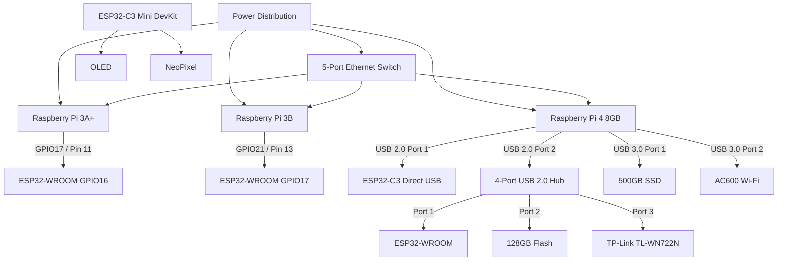
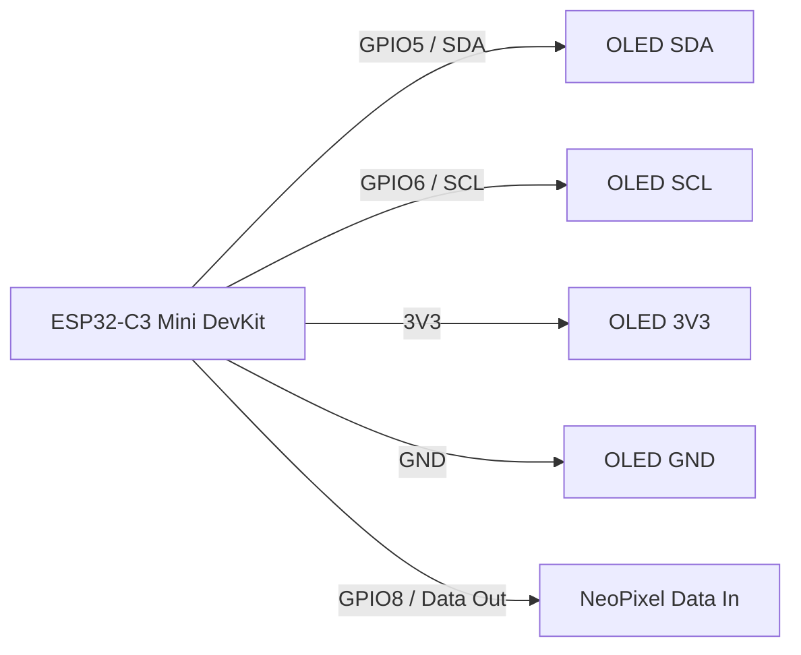

# ULTRON Circuit and System Connection Documentation

> **Source:** ULTRON Architecture Design diagram supplied by the project team  
> **Document type:** Hardware, network, GPIO, USB, power and peripheral connection reference  
> **Status:** Diagram-derived documentation  
>
> **Important:** This document records what is visibly represented in the supplied architecture diagram. Where a wire endpoint, device identity, or connection is ambiguous, it is explicitly marked for verification rather than being guessed.

---

## 1. System Overview

The ULTRON architecture shown in the source diagram is organized into six major areas:

1. **Power Distribution**
2. **Ethernet Network Map**
3. **Tripwire GPIO Logic**
4. **Raspberry Pi 4 Host**
5. **USB Hub Downstream**
6. **ESP32-C3 Peripherals**

The architecture contains multiple Raspberry Pi nodes connected through a 5-port Ethernet switch. A Raspberry Pi 4 8GB is additionally represented as the central host for USB peripherals, storage, wireless adapters, an ESP32-C3, and a USB hub.

A separate GPIO-based tripwire path connects the Raspberry Pi nodes to an ESP32-WROOM. The ESP32-C3 peripheral section provides an OLED display over SDA/SCL and a NeoPixel over a data output.

### High-level system relationship

```text
                     ULTRON HARDWARE ARCHITECTURE
                     ============================

       POWER DISTRIBUTION
              │
      ┌───────┼─────────────────────────────────────┐
      │       │                  │                  │
      ▼       ▼                  ▼                  ▼
    Pi 4    Pi 3A+             Pi 3B         Ethernet Switch
      │       │                  │                  │
      │       └────────────┬─────┘                  │
      │                    │                        │
      │                    ▼                        │
      │             Tripwire / Network              │
      │                    │                        │
      │                    └──────► ESP32-WROOM      │
      │                                             │
      └────────────────── Ethernet ────────────────┘
      │
      ├── USB 2.0 ──► ESP32-C3 Direct USB
      │
      ├── USB 3.0 ──► AC600 Wi-Fi
      │
      ├── USB 3.0 ──► 500GB SSD NAS Storage
      │
      └── USB 2.0 ──► 4-Port USB 2.0 Hub
                         │
                         ├── Hub Port 1 ──► ESP32-WROOM
                         ├── Hub Port 2 ──► 128GB USB Flash Drive
                         └── Hub Port 3 ──► TP-Link TL-WN722N

 ESP32-C3 Mini DevKit
       │
       ├── GPIO5 ──► SDA ──► OLED
       ├── GPIO6 ──► SCL ──► OLED
       ├── 3V3 ────────────► OLED
       ├── GND ────────────► OLED
       └── GPIO8 ──► DATA ──► NeoPixel
```

---

# 2. Complete Component Inventory

| ID | Component | Model / Specification shown | Quantity represented | Interface(s) shown | Main purpose |
|---|---|---|---:|---|---|
| P1 | Raspberry Pi 4 | Pi 4, 8GB | 1 | USB, Ethernet, GPIO/power | Main host |
| P2 | Raspberry Pi 3A+ | Pi 3A+ | 1 | Micro-USB, Ethernet, GPIO | Network/tripwire node |
| P3 | Raspberry Pi 3B | Pi 3B | 1 | Micro-USB, Ethernet, GPIO | Network/tripwire node |
| N1 | Ethernet switch | 5-Port Ethernet Switch | 1 | RJ45, DC barrel power | Network interconnect |
| E1 | ESP32 | ESP32-WROOM | 1 | GPIO16, GPIO17, USB/serial | Tripwire / serial peripheral |
| E2 | ESP32 | ESP32-C3 Direct USB | 1 shown | USB | Direct USB-connected controller |
| E3 | ESP32 | ESP32-C3 Mini DevKit | 1 shown | USB, GPIO5, GPIO6, GPIO8, 3V3, GND | OLED/NeoPixel controller |
| U1 | USB hub | 4-Port USB 2.0 Hub | 1 | Upstream USB, downstream USB | USB expansion |
| W1 | Wi-Fi adapter | AC600 Wi-Fi Antenna | 1 | USB 3.0 | Wireless interface |
| W2 | Wi-Fi adapter | TP-Link TL-WN722N High-Gain Antenna | 1 | USB hub connection | Wireless interface |
| S1 | Storage | 500GB SSD NAS Storage | 1 | USB 3.0 | Bulk storage |
| S2 | Storage | 128GB USB Flash Drive | 1 | USB hub | Removable storage |
| D1 | Display | OLED Display | 1 | I2C SDA/SCL, 3V3, GND | Status/display output |
| L1 | LED | NeoPixel LED | 1 shown | Data In | Visual status output |
| F1 | Cooling fan | Internal Fan | 1 | +5V, GND | Raspberry Pi cooling |
| PW1 | Power source | AC Outlet 1, Dual-Head Y-Splitter | 1 | AC output | Supplies Pi 4 and Pi 3A+ |
| PW2 | Power source | AC Outlet 2, Micro-USB Adapter | 1 | Micro-USB | Supplies Pi 3B |
| PW3 | Power source | AC Outlet 3, Switch Adapter | 1 | DC barrel | Supplies Ethernet switch |
| UPL1 | Unused/uplink port | Switch Port 1 | 1 | RJ45 | Empty / uplink |
| UPL2 | Unused/downlink port | Switch Port 5 | 1 | RJ45 | Empty / downlink |

---

# 3. Power Distribution

## 3.1 Power connections visible in the diagram

| # | Source | Connector / Output | Destination | Input | Voltage / Rating shown | Purpose |
|---|---|---|---|---|---|---|
| PWR-01 | AC Outlet 1 Dual-Head Y-Splitter | USB-C | Raspberry Pi 4 | USB-C | 5V / 3A | Pi 4 power |
| PWR-02 | AC Outlet 1 Dual-Head Y-Splitter | Micro-USB | Raspberry Pi 3A+ | Micro-USB | 5V / 2.5A | Pi 3A+ power |
| PWR-03 | AC Outlet 2 Micro-USB Adapter | Micro-USB | Raspberry Pi 3B | Micro-USB | 5V / 2.5A | Pi 3B power |
| PWR-04 | AC Outlet 3 Switch Adapter | DC barrel | 5-Port Ethernet Switch | DC barrel input | Rating not stated | Switch power |
| PWR-05 | Raspberry Pi 4 | +5V, physical pin 4 | Internal Fan red wire | Fan +5V | +5V | Fan power |
| PWR-06 | Raspberry Pi 4 | GND, physical pin 6 | Internal Fan black wire | Fan GND | GND | Fan return |

## 3.2 ASCII power circuit

```text
                         ┌──────────────────────────┐
                         │ AC Outlet 1              │
                         │ Dual-Head Y-Splitter     │
                         └────────────┬─────────────┘
                                      │
                    ┌─────────────────┴─────────────────┐
                    │                                   │
                    │ USB-C 5V / 3A                    │ Micro-USB 5V / 2.5A
                    ▼                                   ▼
            ┌────────────────┐                  ┌─────────────────┐
            │ Raspberry Pi 4 │                  │ Raspberry Pi 3A+│
            │     8GB        │                  │                 │
            └────────────────┘                  └─────────────────┘


                         ┌──────────────────────────┐
                         │ AC Outlet 2              │
                         │ Micro-USB Adapter        │
                         └────────────┬─────────────┘
                                      │
                            Micro-USB 5V / 2.5A
                                      │
                                      ▼
                              ┌─────────────────┐
                              │ Raspberry Pi 3B │
                              └─────────────────┘


                         ┌──────────────────────────┐
                         │ AC Outlet 3              │
                         │ Switch Adapter           │
                         └────────────┬─────────────┘
                                      │
                                  DC barrel
                                      │
                                      ▼
                              ┌─────────────────┐
                              │ 5-Port Ethernet │
                              │     Switch      │
                              └─────────────────┘


 Raspberry Pi 4
 ┌──────────────────────────┐
 │ Physical Pin 4  +5V      │──────────────► Fan RED
 │ Physical Pin 6  GND      │──────────────► Fan BLACK
 └──────────────────────────┘
```

---

# 4. Ethernet Network Architecture

The switch is shown with five RJ45 ports.

| Switch Port | Destination / State | Destination interface shown | Status |
|---|---|---|---|
| Port 1 | Empty / Uplink | RJ45 | No active endpoint shown |
| Port 2 | Raspberry Pi 3A+ | Ethernet | Connected |
| Port 3 | Raspberry Pi 4 8GB | Gigabit Ethernet | Connected |
| Port 4 | Raspberry Pi 3B | Ethernet | Connected |
| Port 5 | Empty / Downlink | RJ45 | No active endpoint shown |

## 4.1 ASCII Ethernet circuit

```text
                         ┌───────────────────────────┐
                         │     5-PORT ETHERNET       │
                         │          SWITCH           │
                         └───────────────────────────┘
                           │       │       │       │
                           │       │       │       │
                         P1      P2      P3      P4       P5
                         │       │       │       │        │
                       Empty   RJ45    RJ45    RJ45    Empty
                       Uplink    │       │       │      Downlink
                                 │       │       │
                                 ▼       ▼       ▼
                               Pi 3A+   Pi 4 8GB   Pi 3B
                               Ethernet Gigabit    Ethernet
```

---

# 5. Tripwire GPIO Logic

The lower-left portion of the source diagram shows a dedicated **Tripwire GPIO Logic** section.

## 5.1 Visible GPIO mapping

| Signal | Source | Source GPIO | Source physical pin | Destination | Destination GPIO | Status |
|---|---|---:|---:|---|---:|---|
| Tripwire A | Raspberry Pi 3A+ | GPIO17 | Pin 11 | ESP32-WROOM | GPIO16 | Shown |
| Tripwire B | Raspberry Pi 3B | GPIO21 | Pin 13 | ESP32-WROOM | GPIO17 | Shown |
| Shared ground | System Common GND | Not numbered in diagram | N/A | ESP32-WROOM / tripwire circuit | GND relationship indicated | Endpoint requires verification |

## 5.2 Tripwire A

```text
Raspberry Pi 3A+                          ESP32-WROOM
┌────────────────────┐                  ┌────────────────────┐
│ GPIO17             │                  │ GPIO16             │
│ Physical Pin 11    │─────────────────►│ Tripwire A         │
└────────────────────┘                  └────────────────────┘
```

## 5.3 Tripwire B

```text
Raspberry Pi 3B                           ESP32-WROOM
┌────────────────────┐                  ┌────────────────────┐
│ GPIO21             │                  │ GPIO17             │
│ Physical Pin 13    │─────────────────►│ Tripwire B         │
└────────────────────┘                  └────────────────────┘
```

## 5.4 Shared ground

```text
                 ┌────────────────────────┐
                 │   System Common GND    │
                 └───────────┬────────────┘
                             │
                        Shared GND
                             │
                             ▼
                      ┌───────────────┐
                      │ ESP32-WROOM   │
                      │     GND       │
                      └───────────────┘
```

> **Verification note:** The source image labels this region "Shared GND", but the complete ground path to all GPIO-capable boards is not unambiguously represented at the pixel level. Verify the actual hardware ground connections before applying power.

---

# 6. Raspberry Pi 4 Host

The Raspberry Pi 4 8GB is the central host shown inside the green **Raspberry Pi 4 Host** area.

## 6.1 Pi 4 interfaces represented

| Interface / Port | Connected device | Connection type | Purpose |
|---|---|---|---|
| Ethernet Port 3 | 5-Port Ethernet Switch | Gigabit Ethernet | Network |
| USB 2.0 Port 1 | ESP32-C3 Direct USB | USB, labelled "5V + UART" | Direct controller/serial connection |
| USB 2.0 Port 2 | 4-Port USB 2.0 Hub | USB 2.0 | USB expansion |
| USB 3.0 Port 1 | 500GB SSD NAS Storage | USB 3.0 | Storage |
| USB 3.0 Port 2 | AC600 Wi-Fi Antenna | USB 3.0 | Wireless |
| Physical Pin 4 | Internal Fan red wire | +5V | Fan power |
| Physical Pin 6 | Internal Fan black wire | GND | Fan return |

## 6.2 ASCII Pi 4 host map

```text
                           ┌─────────────────────────────┐
                           │      RASPBERRY PI 4 8GB     │
                           │           HOST              │
                           └─────────────────────────────┘
                              │       │       │       │
                              │       │       │       │
                         Ethernet   USB2.0  USB2.0  USB3.0 / USB3.0
                            │        │       │         │       │
                            │        │       │         │       │
                            ▼        ▼       ▼         ▼       ▼
                         Switch   ESP32-C3   USB Hub   AC600   500GB SSD
                                   Direct
                                   USB


 Fan:
 Physical Pin 4 (+5V) ───────────────────────────► Fan RED
 Physical Pin 6 (GND) ───────────────────────────► Fan BLACK
```

---

# 7. Raspberry Pi Cooling Fan

The diagram explicitly labels:

- **Fan Red +5V Pin 4**
- **Fan Black GND Pin 6**

and also shows the Raspberry Pi 4 physical pin references.

```text
                RASPBERRY PI 4
        ┌─────────────────────────────┐
        │ Physical Pin 4 = +5V        │──────► FAN RED
        │ Physical Pin 6 = GND        │──────► FAN BLACK
        └─────────────────────────────┘

                         ┌─────────────┐
                         │ Internal Fan│
                         │ Red = +5V   │
                         │ Black = GND │
                         └─────────────┘
```

> **Engineering note:** The diagram specifies the supply pins, but the exact fan current draw is not provided. Verify fan current and connector termination against the actual hardware.

---

# 8. USB Architecture

## 8.1 USB connection table

| # | Raspberry Pi 4 port | USB type shown | Destination | Function / label |
|---|---|---|---|---|
| USB-01 | USB 2.0 Port 1 | USB 2.0 | ESP32-C3 Direct USB | 5V + UART shown |
| USB-02 | USB 2.0 Port 2 | USB 2.0 | 4-Port USB 2.0 Hub | USB expansion |
| USB-03 | USB 3.0 Port 1 | USB 3.0 | 500GB SSD NAS Storage | Storage |
| USB-04 | USB 3.0 Port 2 | USB 3.0 | AC600 Wi-Fi Antenna | Wireless adapter |

## 8.2 ASCII USB architecture

```text
                         ┌──────────────────────┐
                         │    Raspberry Pi 4    │
                         │         8GB          │
                         └──────────────────────┘
                           │       │       │       │
                           │       │       │       │
                       USB 2.0  USB 2.0  USB 3.0  USB 3.0
                       Port 1   Port 2   Port 1   Port 2
                           │       │       │       │
                           ▼       ▼       ▼       ▼
                        ESP32-C3  USB Hub  500GB    AC600
                        Direct             SSD      Wi-Fi
                        USB
```

---

# 9. USB Hub Connections

The diagram identifies a **4-Port USB 2.0 Hub**, connected upstream to **Pi 4 USB 2.0 Port 2**.

### Downstream ports shown

| Hub port | Connected device | Label visible in source |
|---|---|---|
| Hub Port 1 | ESP32-WROOM | "Hub Port 1 / 5V + Serial" |
| Hub Port 2 | 128GB USB Flash Drive | "Hub Port 2" |
| Hub Port 3 | TP-Link TL-WN722N High-Gain Antenna | "Hub Port 3" |
| Hub Port 4 | No downstream connection shown | Not shown |

## 9.1 ASCII USB hub

```text
                          Raspberry Pi 4
                               │
                               │ USB 2.0 Port 2
                               ▼
                   ┌─────────────────────────┐
                   │   4-Port USB 2.0 Hub    │
                   └─────────────────────────┘
                       │          │          │
                       │          │          │
                    Port 1      Port 2      Port 3
                       │          │          │
                       ▼          ▼          ▼
                 ESP32-WROOM   128GB USB   TP-Link
                               Flash Drive  TL-WN722N
                                           High-Gain
                                           Antenna

                     Port 4: no connection shown
```

---

# 10. ESP32-WROOM Connections

The ESP32-WROOM appears in two architectural roles:

1. GPIO tripwire interface
2. USB Hub downstream peripheral

## 10.1 GPIO role

```text
Pi 3A+ GPIO17 / Pin 11 ───── Tripwire A ─────► ESP32-WROOM GPIO16

Pi 3B GPIO21 / Pin 13 ────── Tripwire B ─────► ESP32-WROOM GPIO17
```

## 10.2 USB role

```text
4-Port USB Hub
      │
      │ Hub Port 1
      │ 5V + Serial
      ▼
┌───────────────────────┐
│      ESP32-WROOM      │
│                       │
│ GPIO16 ◄── Tripwire A │
│ GPIO17 ◄── Tripwire B │
└───────────────────────┘
```

> **Verification note:** The image labels the Hub Port 1 connection as "5V + Serial". The exact UART TX/RX pin assignment is not specified in the supplied diagram. Do not infer a particular ESP32 UART peripheral without the actual hardware/firmware design.

---

# 11. ESP32-C3 Direct USB Connection

The central purple block inside the Raspberry Pi 4 host area is labelled:

**ESP32-C3 Direct USB**

It is connected from:

```text
Raspberry Pi 4
USB 2.0 Port 1
5V + UART
      │
      │ USB
      ▼
ESP32-C3
Direct USB
```

The source diagram therefore indicates a USB connection and labels the path "5V + UART".

> **Verification note:** The diagram does not provide enough information to uniquely identify the exact ESP32 UART pins or USB protocol behavior. Treat the "UART" label as the project's intended connection description.

---

# 12. ESP32-C3 Mini DevKit Connections

The lower-right teal block is labelled:

**ESP32-C3 Mini DevKit**

and contains the following visible signal labels:

- GPIO 5 → SDA
- GPIO 6 → SCL
- 3V3
- GND
- GPIO 8 → Data Out
- USB from Pi 4 USB 2.0 Port 1

## 12.1 Pin map

| ESP32-C3 Mini pin | Signal | Destination | Function |
|---|---|---|---|
| GPIO5 | SDA | OLED | I2C data line, based on labels |
| GPIO6 | SCL | OLED | I2C clock line, based on labels |
| 3V3 | 3.3V | OLED | OLED supply |
| GND | Ground | OLED | Electrical reference |
| GPIO8 | Data Out | NeoPixel Data In | LED control signal |

## 12.2 ASCII ESP32-C3 peripheral circuit

```text
                    ┌──────────────────────────────┐
                    │     ESP32-C3 MINI DEVKIT     │
                    │                              │
                    │ GPIO5 ──────────────────────┼────► SDA
                    │ GPIO6 ──────────────────────┼────► SCL
                    │ 3V3 ────────────────────────┼────► 3V3
                    │ GND ────────────────────────┼────► GND
                    │ GPIO8 ──────────────────────┼────► DATA OUT
                    └──────────────────────────────┘
                               │              │
                               │              │
                               ▼              ▼
                        ┌─────────────┐  ┌──────────────┐
                        │ OLED Display│  │   NeoPixel   │
                        │ I2C         │  │     LED      │
                        └─────────────┘  └──────────────┘
```

---

# 13. OLED Display Interface

The source labels the OLED as:

**OLED Display**
**I2C SDA/SCL**
**3V3 + GND**

Therefore the visible interface is:

```text
ESP32-C3 Mini DevKit
        │
        ├──────── GPIO5 ─────────► OLED SDA
        │
        ├──────── GPIO6 ─────────► OLED SCL
        │
        ├──────── 3V3 ───────────► OLED 3V3
        │
        └──────── GND ───────────► OLED GND
```

### Signal roles

| Signal | Source | Destination | Role |
|---|---|---|---|
| SDA | ESP32-C3 GPIO5 | OLED SDA | I2C data |
| SCL | ESP32-C3 GPIO6 | OLED SCL | I2C clock |
| 3V3 | ESP32-C3 3V3 | OLED 3V3 | Power |
| GND | ESP32-C3 GND | OLED GND | Ground |

> The word **I2C** is supported by the explicit SDA/SCL labels in the source.

---

# 14. NeoPixel Interface

The source diagram labels the ESP32-C3 output:

**GPIO 8 Data Out**

and the NeoPixel input:

**Data In**

Thus:

```text
ESP32-C3 Mini DevKit                     NeoPixel LED
┌──────────────────────┐                ┌───────────────┐
│ GPIO8                │───────────────►│ Data In       │
│ "Data Out"           │    LED DATA    │               │
└──────────────────────┘                └───────────────┘
```

Only the data path is clearly shown between these two blocks. A separate NeoPixel power/ground connection is not visibly detailed in the supplied image, so those connections are **not assumed** here.

---

# 15. Storage Devices

## 15.1 500GB SSD NAS Storage

The storage block is connected directly from:

```text
Raspberry Pi 4
USB 3.0 Port 1
      │
      ▼
500GB SSD NAS Storage
```

Table:

| Device | Host | Host port | Interface | Purpose |
|---|---|---|---|---|
| 500GB SSD NAS Storage | Raspberry Pi 4 | USB 3.0 Port 1 | USB 3.0 | Storage |

The source does not specify filesystem, mount point, RAID, or NAS protocol.

## 15.2 128GB USB Flash Drive

```text
Raspberry Pi 4
      │
USB 2.0 Port 2
      │
      ▼
4-Port USB 2.0 Hub
      │
   Hub Port 2
      │
      ▼
128GB USB Flash Drive
```

---

# 16. Wireless Interfaces

## 16.1 AC600 Wi-Fi Antenna

The source shows:

```text
Raspberry Pi 4
USB 3.0 Port 2
      │
      ▼
AC600 Wi-Fi Antenna
```

## 16.2 TP-Link TL-WN722N High-Gain Antenna

The source shows:

```text
Raspberry Pi 4
USB 2.0 Port 2
      │
      ▼
4-Port USB 2.0 Hub
      │
   Hub Port 3
      │
      ▼
TP-Link TL-WN722N
High-Gain Antenna
```

> **Note:** The diagram's label should be treated as the project-design label. Exact driver, chipset revision, band support, and power requirements are outside the information explicitly encoded in this image.

---

# 17. Complete Master Connection Map

This table is the main reference for physical and logical connections represented in the diagram.

| # | Source | Source Port / Pin | Type | Destination | Destination Port / Pin | Direction / Relation | Purpose |
|---|---|---|---|---|---|---|---|
| C01 | AC Outlet 1 | USB-C 5V/3A | POWER | Pi 4 | USB-C power input | Source → load | Pi 4 power |
| C02 | AC Outlet 1 | Micro-USB 5V/2.5A | POWER | Pi 3A+ | Micro-USB power | Source → load | Pi 3A+ power |
| C03 | AC Outlet 2 | Micro-USB 5V/2.5A | POWER | Pi 3B | Micro-USB power | Source → load | Pi 3B power |
| C04 | AC Outlet 3 | DC barrel | POWER | 5-Port switch | DC input | Source → load | Switch power |
| C05 | Ethernet switch | Port 2 RJ45 | ETHERNET | Pi 3A+ | Ethernet | Network | Network link |
| C06 | Ethernet switch | Port 3 RJ45 | ETHERNET | Pi 4 | Gigabit Ethernet | Network | Network link |
| C07 | Ethernet switch | Port 4 RJ45 | ETHERNET | Pi 3B | Ethernet | Network | Network link |
| C08 | Ethernet switch | Port 1 RJ45 | ETHERNET | None shown | Empty/Uplink | Not connected in diagram | Reserved/uplink |
| C09 | Ethernet switch | Port 5 RJ45 | ETHERNET | None shown | Empty/Downlink | Not connected in diagram | Reserved/downlink |
| C10 | Pi 3A+ | GPIO17, physical Pin 11 | GPIO | ESP32-WROOM | GPIO16 | Signal → | Tripwire A |
| C11 | Pi 3B | GPIO21, physical Pin 13 | GPIO | ESP32-WROOM | GPIO17 | Signal → | Tripwire B |
| C12 | Pi 4 | Physical Pin 4 | POWER | Fan | Red | +5V → | Fan power |
| C13 | Pi 4 | Physical Pin 6 | GROUND | Fan | Black | Return → | Fan ground |
| C14 | Pi 4 | USB 2.0 Port 1 | USB | ESP32-C3 Direct USB | USB | Host ↔ device | Direct USB; 5V + UART label |
| C15 | Pi 4 | USB 2.0 Port 2 | USB | 4-Port USB 2.0 Hub | Upstream | Host ↔ hub | USB expansion |
| C16 | Pi 4 | USB 3.0 Port 1 | USB | 500GB SSD NAS | USB | Host ↔ device | Storage |
| C17 | Pi 4 | USB 3.0 Port 2 | USB | AC600 Wi-Fi | USB | Host ↔ device | Wireless |
| C18 | USB Hub | Hub Port 1 | USB | ESP32-WROOM | USB | Hub ↔ device | 5V + Serial label |
| C19 | USB Hub | Hub Port 2 | USB | 128GB Flash Drive | USB | Hub ↔ device | Removable storage |
| C20 | USB Hub | Hub Port 3 | USB | TP-Link TL-WN722N | USB | Hub ↔ device | Wireless |
| C21 | ESP32-C3 Mini | GPIO5 | I2C | OLED | SDA | Signal → | I2C data |
| C22 | ESP32-C3 Mini | GPIO6 | I2C | OLED | SCL | Signal → | I2C clock |
| C23 | ESP32-C3 Mini | 3V3 | POWER | OLED | 3V3 | Supply → | OLED power |
| C24 | ESP32-C3 Mini | GND | GROUND | OLED | GND | Reference | OLED ground |
| C25 | ESP32-C3 Mini | GPIO8 | LED DATA | NeoPixel | Data In | Signal → | LED data |
| C26 | ESP32-C3 Mini | USB from Pi 4 USB 2.0 Port 1 | USB | Pi 4 | Port reference shown | Host ↔ device | USB path label |
| C27 | System Common GND | GND | GROUND | ESP32-WROOM / tripwire circuit | GND relation | Shared reference | Tripwire ground |
| C28 | Pi 3A+ / Pi 3B | Dotted "Tripwire node" relationship | LOGICAL / NETWORK | Pi 4 Host region | Tripwire node | Logical relationship | Diagram-level tripwire relation |

> **C28 requires verification.** The green dotted "Tripwire node" lines are architecture-level lines rather than ordinary cable drawings. Their exact physical implementation should not be inferred from the dotted line alone.

---

# 18. Power, Ground, Data and Control Classification

| Connection category | Connections |
|---|---|
| POWER | C01, C02, C03, C04, C12, C23 |
| GROUND | C13, C24, C27 |
| ETHERNET | C05, C06, C07, C08, C09 |
| USB | C14, C15, C16, C17, C18, C19, C20, C26 |
| GPIO | C10, C11 |
| I2C | C21, C22 |
| LED DATA | C25 |
| STORAGE | C16, C19 |
| WIRELESS | C17, C20 |
| LOGICAL / ARCHITECTURAL | C28 |

---

# 19. Complete System Data Flow

## 19.1 Power flow

```text
AC
│
├──► Raspberry Pi 4
├──► Raspberry Pi 3A+
├──► Raspberry Pi 3B
└──► Ethernet Switch

Raspberry Pi 4
└──► +5V / GND fan connection
```

## 19.2 Ethernet flow

```text
                 ┌─────────────────────┐
                 │ 5-Port Ethernet     │
                 │       Switch        │
                 └─────────────────────┘
                    │      │      │
                    ▼      ▼      ▼
                  Pi3A+    Pi4     Pi3B
```

## 19.3 USB flow

```text
Pi 4
├── USB 2.0 Port 1 ──► ESP32-C3 Direct USB
├── USB 2.0 Port 2 ──► USB Hub
│                      ├── Port 1 ──► ESP32-WROOM
│                      ├── Port 2 ──► 128GB Flash
│                      └── Port 3 ──► TP-Link Wi-Fi
├── USB 3.0 Port 1 ──► 500GB SSD
└── USB 3.0 Port 2 ──► AC600 Wi-Fi
```

## 19.4 Tripwire GPIO flow

```text
Pi 3A+ GPIO17 / Pin 11 ──────► ESP32-WROOM GPIO16
                                      │
                                      │ Tripwire A

Pi 3B GPIO21 / Pin 13 ───────► ESP32-WROOM GPIO17
                                      │
                                      │ Tripwire B
```

## 19.5 OLED data flow

```text
ESP32-C3 GPIO5 ──► SDA ──► OLED
ESP32-C3 GPIO6 ──► SCL ──► OLED
ESP32-C3 3V3 ─────────────► OLED 3V3
ESP32-C3 GND ─────────────► OLED GND
```

## 19.6 NeoPixel control

```text
ESP32-C3 GPIO8
      │
      │ Data Out
      ▼
NeoPixel Data In
```

---

# 20. Raspberry Pi Pin Usage

| Raspberry Pi | GPIO | Physical pin | Connected to | Function |
|---|---:|---:|---|---|
| Pi 3A+ | GPIO17 | Pin 11 | ESP32-WROOM GPIO16 | Tripwire A |
| Pi 3B | GPIO21 | Pin 13 | ESP32-WROOM GPIO17 | Tripwire B |
| Pi 4 | N/A | Pin 4 | Fan red | +5V |
| Pi 4 | N/A | Pin 6 | Fan black | GND |

> GPIO numbering and physical header pin numbering are intentionally shown as separate columns.

---

# 21. ESP32 Pin Usage

| ESP32 | GPIO | Signal | Connected device | Function |
|---|---:|---|---|---|
| ESP32-WROOM | GPIO16 | Tripwire A | Pi 3A+ GPIO17 | Tripwire input/output as designed |
| ESP32-WROOM | GPIO17 | Tripwire B | Pi 3B GPIO21 | Tripwire input/output as designed |
| ESP32-C3 Mini | GPIO5 | SDA | OLED | I2C data |
| ESP32-C3 Mini | GPIO6 | SCL | OLED | I2C clock |
| ESP32-C3 Mini | GPIO8 | Data Out | NeoPixel Data In | LED control |
| ESP32-C3 Mini | 3V3 | Power | OLED 3V3 | Peripheral power |
| ESP32-C3 Mini | GND | Ground | OLED GND | Peripheral reference |

---

# 22. Connector Reference

| Connector / Interface | Used in architecture | Function |
|---|---|---|
| USB-C | Pi 4 power | 5V power |
| Micro-USB | Pi 3A+ / Pi 3B power | 5V power |
| DC barrel | Ethernet switch | Switch power |
| RJ45 | Ethernet switch | Ethernet networking |
| Raspberry Pi GPIO header | Pi 3A+, Pi 3B, Pi 4 | GPIO / power |
| USB 2.0 | Pi 4, hub | USB peripherals |
| USB 3.0 | Pi 4 | High-speed peripherals |
| UART / Serial | Labelled on ESP32-C3 direct USB and ESP32-WROOM hub connection | Serial communication, exact mapping not shown |
| I2C | ESP32-C3 Mini → OLED | SDA/SCL display interface |
| NeoPixel data | ESP32-C3 GPIO8 → LED Data In | Digital LED control |

---

# 23. Text-Based Circuit Diagrams

## 23.1 Complete system wiring view

```text
                                   ULTRON COMPLETE WIRING
                                   ======================

   POWER
   ─────
   AC Outlet 1
      │
      ├── USB-C 5V/3A ──────────────────────► Raspberry Pi 4 8GB
      │
      └── Micro-USB 5V/2.5A ───────────────► Raspberry Pi 3A+

   AC Outlet 2
      │
      └── Micro-USB 5V/2.5A ───────────────► Raspberry Pi 3B

   AC Outlet 3
      │
      └── DC Barrel ────────────────────────► 5-Port Ethernet Switch


   ETHERNET
   ────────
                              ┌───────────────────────┐
                              │  5-PORT ETHERNET     │
                              │       SWITCH         │
                              └───────────────────────┘
                                │      │      │
                            Port 2   Port 3  Port 4
                                │      │      │
                                ▼      ▼      ▼
                              Pi 3A+   Pi4    Pi 3B
                              Eth.    GbE     Eth.


   TRIPWIRE GPIO
   ─────────────
   Pi 3A+ GPIO17 / Pin11 ────── Tripwire A ─────► ESP32-WROOM GPIO16
   Pi 3B GPIO21 / Pin13 ─────── Tripwire B ─────► ESP32-WROOM GPIO17

   System Common GND ─────────► Shared GND / ESP32-WROOM
   [Verify complete physical common-ground implementation]


   RASPBERRY PI 4 USB
   ──────────────────
   Raspberry Pi 4
      │
      ├── USB 2.0 Port 1 ──► ESP32-C3 Direct USB
      │                         "5V + UART" label
      │
      ├── USB 2.0 Port 2 ──► 4-Port USB 2.0 Hub
      │                         ├── Hub Port 1 ──► ESP32-WROOM
      │                         ├── Hub Port 2 ──► 128GB USB Flash
      │                         └── Hub Port 3 ──► TP-Link TL-WN722N
      │
      ├── USB 3.0 Port 1 ──► 500GB SSD NAS Storage
      │
      └── USB 3.0 Port 2 ──► AC600 Wi-Fi Antenna


   FAN
   ───
   Pi 4 Physical Pin 4 (+5V) ──► Fan RED
   Pi 4 Physical Pin 6 (GND) ──► Fan BLACK


   ESP32-C3 MINI PERIPHERALS
   ─────────────────────────
   ESP32-C3 Mini DevKit
      │
      ├── GPIO5 ──► SDA ──► OLED
      ├── GPIO6 ──► SCL ──► OLED
      ├── 3V3 ────────────► OLED 3V3
      ├── GND ────────────► OLED GND
      └── GPIO8 ──► DATA ─► NeoPixel
```

---

## 23.2 Power circuit

```text
                         ┌────────────────────────────┐
                         │ AC OUTLET 1                │
                         │ Dual-Head Y-Splitter       │
                         └────────────┬───────────────┘
                                      │
                         ┌────────────┴────────────┐
                         │                         │
                  USB-C 5V/3A              Micro-USB 5V/2.5A
                         │                         │
                         ▼                         ▼
                 ┌──────────────┐         ┌────────────────┐
                 │ Raspberry Pi4│         │ Raspberry Pi3A+│
                 └──────────────┘         └────────────────┘


                         ┌────────────────────────────┐
                         │ AC OUTLET 2                │
                         │ Micro-USB Adapter          │
                         └────────────┬───────────────┘
                                      │
                              Micro-USB 5V/2.5A
                                      │
                                      ▼
                              ┌──────────────┐
                              │ Raspberry Pi3B│
                              └──────────────┘


                         ┌────────────────────────────┐
                         │ AC OUTLET 3                │
                         │ Switch Adapter             │
                         └────────────┬───────────────┘
                                      │
                                  DC BARREL
                                      │
                                      ▼
                              ┌─────────────────┐
                              │ Ethernet Switch │
                              └─────────────────┘
```

---

## 23.3 Ethernet network

```text
                     ┌──────────────────────────┐
                     │ 5-PORT ETHERNET SWITCH   │
                     └──────────────────────────┘
                       │     │     │
                     P2      P3    P4
                       │     │     │
                       ▼     ▼     ▼
                     Pi 3A+  Pi4   Pi 3B
                     Eth.    GbE    Eth.

                     P1 ── Empty / Uplink
                     P5 ── Empty / Downlink
```

---

## 23.4 Tripwire GPIO

```text
        Raspberry Pi 3A+                 ESP32-WROOM
       ┌───────────────┐                ┌───────────────┐
       │ GPIO17        │────────────────► GPIO16        │
       │ Physical Pin11│   Tripwire A   │               │
       └───────────────┘                └───────────────┘


        Raspberry Pi 3B                  ESP32-WROOM
       ┌───────────────┐                ┌───────────────┐
       │ GPIO21        │────────────────► GPIO17        │
       │ Physical Pin13│   Tripwire B   │               │
       └───────────────┘                └───────────────┘


                 System Common GND
                         │
                         └──────► Shared GND / ESP32-WROOM
```

---

## 23.5 Raspberry Pi 4 USB tree

```text
                       ┌──────────────────┐
                       │ Raspberry Pi 4   │
                       │       8GB        │
                       └──────────────────┘
                         │   │   │   │
               ┌─────────┘   │   │   └─────────────┐
               │             │   │                 │
          USB2 P1         USB2 P2 USB3 P1       USB3 P2
               │             │     │                 │
               ▼             ▼     ▼                 ▼
           ESP32-C3      USB HUB  SSD              AC600
           Direct USB       │
                       ┌─────┼─────┐
                       │     │     │
                      P1    P2    P3
                       │     │     │
                       ▼     ▼     ▼
                    ESP32   128GB   TP-Link
                    WROOM    Flash  TL-WN722N
```

---

## 23.6 ESP32-C3 Mini peripheral wiring

```text
                           ┌─────────────────────┐
                           │ ESP32-C3 MINI DEVKIT│
                           └─────────────────────┘
                              │  │  │  │  │
                              │  │  │  │  └──── GPIO8 / DATA
                              │  │  │  └─────── GND
                              │  │  └────────── 3V3
                              │  └───────────── GPIO6 / SCL
                              └──────────────── GPIO5 / SDA
                                  │      │
                                  ▼      ▼
                             ┌────────┐ ┌───────────┐
                             │  OLED  │ │ NeoPixel  │
                             └────────┘ └───────────┘
```

---

# 24. Mermaid Architecture Diagrams

## 24.1 Overall architecture



## 24.2 ESP32-C3 peripheral architecture



---

# 25. Detailed Connection-by-Connection Explanation

## Connection 01: AC Outlet 1 to Raspberry Pi 4

**Source:** AC Outlet 1 Dual-Head Y-Splitter  
**Interface:** USB-C  
**Output:** 5V / 3A  
**Destination:** Raspberry Pi 4  
**Purpose:** Provides the primary power source shown for the Pi 4.

**Status:** SHOWN

---

## Connection 02: AC Outlet 1 to Raspberry Pi 3A+

**Source:** AC Outlet 1 Dual-Head Y-Splitter  
**Interface:** Micro-USB  
**Output:** 5V / 2.5A  
**Destination:** Raspberry Pi 3A+  
**Purpose:** Supplies the Pi 3A+.

**Status:** SHOWN

---

## Connection 03: AC Outlet 2 to Raspberry Pi 3B

**Source:** AC Outlet 2 Micro-USB Adapter  
**Interface:** Micro-USB  
**Rating:** 5V / 2.5A  
**Destination:** Raspberry Pi 3B  
**Purpose:** Supplies Pi 3B power.

**Status:** SHOWN

---

## Connection 04: AC Outlet 3 to Ethernet Switch

**Source:** AC Outlet 3 Switch Adapter  
**Interface:** DC barrel  
**Destination:** 5-Port Ethernet Switch  
**Purpose:** Switch power.

**Status:** SHOWN

---

## Connection 05: Switch Port 2 to Raspberry Pi 3A+

**Source:** 5-Port Ethernet Switch, Port 2  
**Connector:** RJ45  
**Destination:** Raspberry Pi 3A+ Ethernet  
**Purpose:** Network connection.

**Status:** SHOWN

---

## Connection 06: Switch Port 3 to Raspberry Pi 4

**Source:** Ethernet Switch, Port 3  
**Connector:** RJ45  
**Destination:** Pi 4 Port 3 / Gigabit Ethernet  
**Purpose:** Network connection.

**Status:** SHOWN

---

## Connection 07: Switch Port 4 to Raspberry Pi 3B

**Source:** Ethernet Switch, Port 4  
**Connector:** RJ45  
**Destination:** Pi 3B Port 4 / Ethernet  
**Purpose:** Network connection.

**Status:** SHOWN

---

## Connection 08: Pi 3A+ GPIO17 to ESP32-WROOM GPIO16

**Source:** Raspberry Pi 3A+ GPIO17  
**Physical header pin:** 11  
**Destination:** ESP32-WROOM GPIO16  
**Label:** Tripwire A  
**Purpose:** Tripwire signal path.

**Status:** SHOWN

---

## Connection 09: Pi 3B GPIO21 to ESP32-WROOM GPIO17

**Source:** Raspberry Pi 3B GPIO21  
**Physical header pin:** 13  
**Destination:** ESP32-WROOM GPIO17  
**Label:** Tripwire B  
**Purpose:** Tripwire signal path.

**Status:** SHOWN

---

## Connection 10: Pi 4 +5V to Fan Red

**Source:** Raspberry Pi 4 physical pin 4  
**Signal:** +5V  
**Destination:** Fan red wire  
**Purpose:** Fan power.

**Status:** SHOWN

---

## Connection 11: Pi 4 GND to Fan Black

**Source:** Raspberry Pi 4 physical pin 6  
**Signal:** GND  
**Destination:** Fan black wire  
**Purpose:** Fan return.

**Status:** SHOWN

---

## Connection 12: Pi 4 USB 2.0 Port 1 to ESP32-C3 Direct USB

**Source:** Raspberry Pi 4 USB 2.0 Port 1  
**Destination:** ESP32-C3 Direct USB  
**Additional label:** 5V + UART  
**Purpose:** Direct controller connection.

**Status:** SHOWN

**Verification:** Exact UART pin/protocol implementation is not shown.

---

## Connection 13: Pi 4 USB 2.0 Port 2 to USB Hub

**Source:** Raspberry Pi 4 USB 2.0 Port 2  
**Destination:** 4-Port USB 2.0 Hub  
**Purpose:** USB expansion.

**Status:** SHOWN

---

## Connection 14: Pi 4 USB 3.0 Port 1 to 500GB SSD

**Source:** Raspberry Pi 4 USB 3.0 Port 1  
**Destination:** 500GB SSD NAS Storage  
**Purpose:** Storage.

**Status:** SHOWN

---

## Connection 15: Pi 4 USB 3.0 Port 2 to AC600

**Source:** Raspberry Pi 4 USB 3.0 Port 2  
**Destination:** AC600 Wi-Fi Antenna  
**Purpose:** Wireless interface.

**Status:** SHOWN

---

## Connection 16: USB Hub Port 1 to ESP32-WROOM

**Source:** USB Hub Port 1  
**Destination:** ESP32-WROOM  
**Label:** 5V + Serial  
**Purpose:** USB/serial peripheral path.

**Status:** SHOWN

**Verification:** Exact serial pin mapping is not visible.

---

## Connection 17: USB Hub Port 2 to 128GB Flash Drive

**Source:** USB Hub Port 2  
**Destination:** 128GB USB Flash Drive  
**Purpose:** Removable storage.

**Status:** SHOWN

---

## Connection 18: USB Hub Port 3 to TP-Link TL-WN722N

**Source:** USB Hub Port 3  
**Destination:** TP-Link TL-WN722N High-Gain Antenna  
**Purpose:** Wireless interface.

**Status:** SHOWN

---

## Connection 19: ESP32-C3 GPIO5 to OLED SDA

**Source:** ESP32-C3 Mini DevKit GPIO5  
**Signal:** SDA  
**Destination:** OLED SDA  
**Purpose:** I2C data.

**Status:** SHOWN / supported by SDA label

---

## Connection 20: ESP32-C3 GPIO6 to OLED SCL

**Source:** ESP32-C3 Mini DevKit GPIO6  
**Signal:** SCL  
**Destination:** OLED SCL  
**Purpose:** I2C clock.

**Status:** SHOWN / supported by SCL label

---

## Connection 21: ESP32-C3 3V3 to OLED 3V3

**Source:** ESP32-C3 Mini DevKit 3V3  
**Destination:** OLED 3V3  
**Purpose:** OLED supply.

**Status:** SHOWN

---

## Connection 22: ESP32-C3 GND to OLED GND

**Source:** ESP32-C3 Mini DevKit GND  
**Destination:** OLED GND  
**Purpose:** Electrical reference.

**Status:** SHOWN

---

## Connection 23: ESP32-C3 GPIO8 to NeoPixel Data In

**Source:** ESP32-C3 Mini DevKit GPIO8 / Data Out  
**Destination:** NeoPixel Data In  
**Purpose:** Digital LED control.

**Status:** SHOWN

---

# 26. Potential Design Issues and Verification Points

This section does **not** declare the design wrong. It identifies things that should be checked on the physical build.

## 26.1 Raspberry Pi to ESP32 GPIO compatibility

The GPIO links shown are:

```text
Pi 3A+ GPIO17 ─► ESP32 GPIO16
Pi 3B GPIO21 ─► ESP32 GPIO17
```

Both Raspberry Pi and ESP32 families commonly use 3.3V logic, but the actual electrical behavior depends on direction, firmware configuration, and the exact board implementation.

**Verification required:** confirm signal direction and logic levels in the actual firmware/hardware.

## 26.2 Common ground

The diagram explicitly calls out **Shared GND** and **System Common GND** around the tripwire system.

**Verification required:** confirm that all devices exchanging GPIO signals have a valid common electrical reference in the real build.

## 26.3 USB power budget

The Pi 4 is shown serving multiple peripherals, including:

- ESP32-C3
- USB Hub
- SSD
- AC600 Wi-Fi adapter

The hub then serves several more devices.

**Verification required:** ensure the actual hub power arrangement and Pi USB power budget are adequate for simultaneous operation.

## 26.4 SSD power

The 500GB SSD is drawn directly from USB 3.0.

**Verification required:** check the SSD enclosure and peak current requirements.

## 26.5 USB hub power

The diagram shows a 4-port USB 2.0 Hub but does not clearly show a separate external power input.

**Verification required:** determine whether the hub is bus-powered or externally powered and confirm that the connected peripherals can be supported.

## 26.6 UART implementation

The diagram uses labels such as:

- "5V + UART"
- "5V + Serial"

but does not specify exact UART pins, voltage conversion circuitry, TX/RX direction, or protocol configuration.

**Verification required:** document actual TX/RX pins and electrical levels.

## 26.7 ESP32-C3 device duplication / Port 1 ambiguity

Two blocks appear related to ESP32-C3:

1. `ESP32-C3 Direct USB`
2. `ESP32-C3 Mini DevKit`

Both references mention **Pi 4 USB 2.0 Port 1** in the diagram.

This is potentially ambiguous because a single physical USB host port normally cannot directly connect to two independent downstream USB devices without a hub or other expansion mechanism.

**Verification required:** determine whether these blocks represent:
- two separate devices,
- one device shown in two functional sections,
- or a documentation duplication.

This should be resolved before final hardware wiring.

## 26.8 NeoPixel power

The diagram clearly shows:

```text
ESP32-C3 GPIO8 → NeoPixel Data In
```

but does not clearly show separate NeoPixel power and ground wiring.

**Verification required:** document the actual NeoPixel VCC and GND connections.

## 26.9 Ethernet Port 1 and Port 5

Both are shown as empty/reserved:

- Port 1: Empty / Uplink
- Port 5: Empty / Downlink

**Verification required:** ensure these labels describe the intended deployment rather than a missing cable in the diagram.

---

# 27. Ambiguous or Unreadable Connections

| # | Area | What is visible | What is unclear | Required verification |
|---|---|---|---|---|
| A1 | Tripwire GND | "Shared GND" and "System Common GND" labels | Complete physical grounding path | Confirm actual ground wiring |
| A2 | ESP32-C3 | Direct USB block and Mini DevKit both reference USB 2.0 Port 1 | Whether these are one device or two | Confirm physical device count and USB topology |
| A3 | ESP32-WROOM serial | "5V + Serial" | Exact UART pins and signal directions | Confirm TX/RX wiring |
| A4 | NeoPixel | GPIO8 Data Out → Data In | Separate LED power and ground not clearly shown | Confirm LED VCC/GND |
| A5 | Tripwire dotted green lines | "Tripwire node" | Exact physical/network implementation | Confirm actual connection medium |
| A6 | Ethernet empty ports | Port 1 / Port 5 labelled empty | Whether intentionally reserved | Confirm deployment plan |

---

# 28. Technical Terminology

## GPIO

General Purpose Input/Output. A programmable digital pin used for reading or controlling signals.

## Physical Pin

The physical position of a pin on a Raspberry Pi header. For example, Raspberry Pi GPIO17 is shown on **physical Pin 11** in this design.

## GND

Ground. The common electrical reference point for power and digital signals.

## 3V3

A 3.3-volt power rail.

## 5V

A 5-volt power rail.

## UART

A serial communication interface commonly used for asynchronous TX/RX communication.

## Serial

A general term for serial digital communication. The exact protocol or pin assignment should be checked against the hardware implementation.

## I2C

A two-wire digital bus using a data line (**SDA**) and clock line (**SCL**).

## SDA

I2C Serial Data line.

## SCL

I2C Serial Clock line.

## USB 2.0

A USB interface generation used by several Pi 4 peripherals and the USB hub in this diagram.

## USB 3.0

A higher-speed USB interface used here for the SSD and AC600 adapter.

## RJ45

The connector commonly used for Ethernet networking.

## Gigabit Ethernet

The diagram's label for the Pi 4 Ethernet path.

## USB Hub

A device that expands one upstream USB connection into multiple downstream USB ports.

## OLED

Organic Light-Emitting Diode display. Here it is represented as an I2C peripheral.

## NeoPixel

An addressable RGB LED family typically controlled through a digital data signal.

## NAS Storage

Network-attached storage terminology. In this diagram the 500GB device is explicitly labelled "NAS Storage", but the actual network/storage protocol is not specified.

## Tripwire

In this architecture, a detection/trigger signal path represented by GPIO connections between Raspberry Pis and the ESP32-WROOM.

## Uplink

A port generally intended to connect the switch to another network device or network layer. Port 1 is labelled "Empty / Uplink" in the diagram.

## Host Device

A device that controls or provides access to a peripheral. The diagram labels the Raspberry Pi 4 as the host context for the USB devices.

---

# 29. Final Connection Verification Checklist

| Category | Status | Notes |
|---|---|---|
| Components | ✅ | Major components are identifiable |
| Power | ✅ | Main power paths are shown |
| Ground | ⚠️ | Shared tripwire ground requires physical verification |
| Ethernet | ✅ | Ports 2, 3 and 4 are shown connected |
| USB | ✅ | Main Pi 4 USB paths are represented |
| USB Hub | ✅ | Ports 1–3 are shown; Port 4 is unconnected in the diagram |
| GPIO | ✅ | Tripwire GPIO numbers are readable |
| UART | ⚠️ | UART is labelled but exact pin mapping is not shown |
| I2C | ✅ | SDA/SCL labels are explicit |
| OLED | ✅ | SDA, SCL, 3V3 and GND are shown |
| NeoPixel | ⚠️ | Data path shown; power/ground not clearly shown |
| Storage | ✅ | SSD and flash drive paths are shown |
| Wireless | ✅ | AC600 and TL-WN722N paths are shown |
| Fan | ✅ | +5V Pin 4 and GND Pin 6 are explicitly shown |
| Tripwire | ⚠️ | Dotted "Tripwire node" architecture lines require interpretation |

---

# 30. Final Hardware Assembly Summary

## Power

- Pi 4 receives USB-C 5V/3A from AC Outlet 1.
- Pi 3A+ receives Micro-USB 5V/2.5A from the second output of AC Outlet 1.
- Pi 3B receives Micro-USB 5V/2.5A from AC Outlet 2.
- Ethernet switch receives power through a DC barrel adapter from AC Outlet 3.
- Pi 4 fan is shown on physical Pin 4 (+5V) and physical Pin 6 (GND).

## Networking

- Ethernet switch Port 2 → Pi 3A+ Ethernet.
- Ethernet switch Port 3 → Pi 4 Gigabit Ethernet.
- Ethernet switch Port 4 → Pi 3B Ethernet.
- Port 1 and Port 5 are labelled empty/reserved.

## Tripwire

- Pi 3A+ GPIO17 / physical Pin 11 → ESP32-WROOM GPIO16, Tripwire A.
- Pi 3B GPIO21 / physical Pin 13 → ESP32-WROOM GPIO17, Tripwire B.
- Shared GND is indicated and should be physically verified.

## Raspberry Pi 4 USB

- USB 2.0 Port 1 → ESP32-C3 Direct USB.
- USB 2.0 Port 2 → 4-Port USB 2.0 Hub.
- USB 3.0 Port 1 → 500GB SSD NAS Storage.
- USB 3.0 Port 2 → AC600 Wi-Fi adapter.

## USB Hub

- Hub Port 1 → ESP32-WROOM.
- Hub Port 2 → 128GB USB Flash Drive.
- Hub Port 3 → TP-Link TL-WN722N.
- Hub Port 4 is not shown connected.

## ESP32-C3 peripherals

- GPIO5 → OLED SDA.
- GPIO6 → OLED SCL.
- 3V3 → OLED 3V3.
- GND → OLED GND.
- GPIO8 → NeoPixel Data In.

## Before powering the complete system

Verify:

1. Actual common-ground implementation.
2. GPIO direction and 3.3V logic compatibility.
3. USB hub power capability.
4. SSD and wireless-adapter current requirements.
5. UART TX/RX pin mapping.
6. NeoPixel power and ground.
7. Whether the two ESP32-C3 blocks represent one physical device or two.
8. The exact meaning of the dotted "Tripwire node" lines.

---

# Appendix A. Compact Pin Reference

```text
RASPBERRY PI 3A+
----------------
GPIO17 = Physical Pin 11
       └────► ESP32-WROOM GPIO16
             Tripwire A


RASPBERRY PI 3B
---------------
GPIO21 = Physical Pin 13
       └────► ESP32-WROOM GPIO17
             Tripwire B


RASPBERRY PI 4
--------------
Physical Pin 4 = +5V ─────► Fan RED
Physical Pin 6 = GND ─────► Fan BLACK


ESP32-C3 MINI DEVKIT
--------------------
GPIO5 ─────► SDA ─────► OLED
GPIO6 ─────► SCL ─────► OLED
3V3  ────────────────► OLED 3V3
GND  ────────────────► OLED GND
GPIO8 ─────► DATA ───► NeoPixel Data In
```

# Appendix B. Compact Port Reference

```text
ETHERNET SWITCH
---------------
Port 1 = Empty / Uplink
Port 2 = Pi 3A+
Port 3 = Pi 4 8GB
Port 4 = Pi 3B
Port 5 = Empty / Downlink


RASPBERRY PI 4
--------------
USB 2.0 Port 1 = ESP32-C3 Direct USB
USB 2.0 Port 2 = 4-Port USB 2.0 Hub
USB 3.0 Port 1 = 500GB SSD
USB 3.0 Port 2 = AC600 Wi-Fi


USB HUB
-------
Hub Port 1 = ESP32-WROOM
Hub Port 2 = 128GB USB Flash Drive
Hub Port 3 = TP-Link TL-WN722N
Hub Port 4 = Not connected in source image
```

# Appendix C. Source-Image Interpretation Rules

This document follows these rules:

- A solid line is treated as a physical connection unless context shows it is a logical/architectural relationship.
- Dotted green "Tripwire node" lines are treated as architecture-level relationships requiring physical verification.
- GPIO number and physical header pin number are kept separate.
- Only labels actually visible in the source image are used as confirmed values.
- Unshown power/ground paths are not invented.
- Unknown UART pin assignments are not fabricated.
- The apparent duplicate ESP32-C3 / USB 2.0 Port 1 representation is explicitly flagged for verification.

---

**End of ULTRON Circuit and System Connection Documentation**
